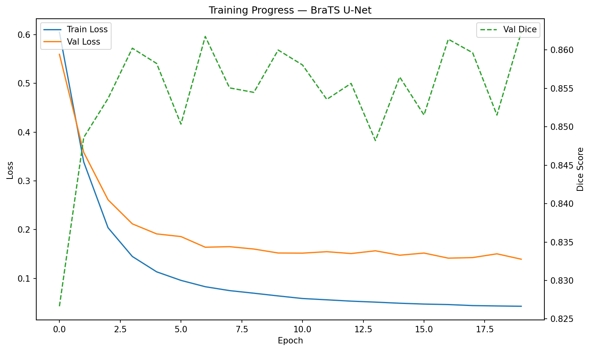
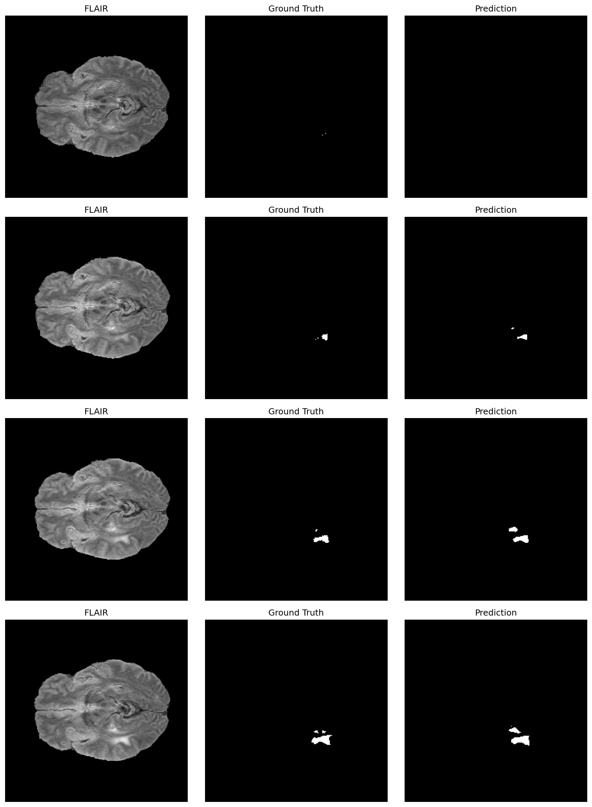

# Brain-Tumour-Segmentation-UNET

A 2D U-Net built from scratch in PyTorch for binary brain tumor segmentation on FLAIR MRI slices, trained on the BraTS2020 dataset.

## Overview
This project implements the full U-Net architecture (encoder, bottleneck, decoder, skip connections) from scratch — no pretrained segmentation models — to segment tumor regions from 2D axial slices extracted from 3D brain MRI volumes.

## Dataset
- **Source:** [BraTS2020 Dataset](https://www.kaggle.com/datasets/awsaf49/brats20-dataset-training-validation) (Kaggle)
- 3D multi-modal MRI volumes (FLAIR, T1, T1ce, T2) with expert-annotated tumor masks
- This project uses the FLAIR modality only, sliced into 2D axial cross-sections
- ~50,000+ 2D slices from 368 patients (240×240 resolution), normalized 0–1, binary tumor masks

## Approach
- **Architecture:** U-Net built from scratch in PyTorch — DoubleConv blocks, MaxPool2D downsampling, ConvTranspose2D upsampling, skip connections between encoder/decoder
- **Loss:** Custom Dice Loss implementation
- **Optimizer:** Adam, lr=1e-4
- **Training:** 20 epochs, mixed-precision (AMP) training on an NVIDIA A100 GPU (Google Colab)
- **Split:** Patient-level 80/20 train/validation split (no slice leakage between sets)

## Results

### Training curves

### Sample predictions

**Final metrics:**
- Best validation Dice score: 0.8623
- Final validation IoU: 0.7752

## How to run
1. Clone this repo
2. `pip install torch torchvision nibabel numpy matplotlib`
3. Download the BraTS2020 dataset from Kaggle
4. Load the trained weights. Trained weights (124MB) are hosted on Google Drive due to GitHub's file size limits: [Download here]([https://drive.google.com/file/d/1uytu9MHWLSH9nbcTDWIV3BgVhAhHkbLa/view?usp=sharing])

## Notes
This is a portfolio/learning project and is not intended for clinical use.

## Author
Isaiah Kim — built as part of a medical imaging ML portfolio, exploring applications relevant to optical and medical imaging research.
